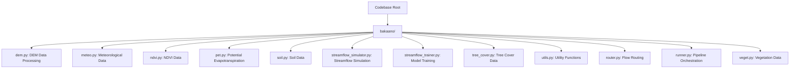

# AI Coding Agent Instructions for Bakaano-Hydro

## Overview
Bakaano-Hydro is a distributed hydrology-guided neural network model for streamflow prediction. It integrates physically based hydrological principles with machine learning to simulate streamflow in a spatially explicit and interpretable manner. The project is designed to generalize across diverse catchments and hydro-climatic regimes, making it particularly useful in data-scarce regions.

## Codebase Architecture
The codebase is modular, with each file in the `bakaano/` directory representing a distinct component of the model:



Each component is designed to be modular and replaceable, allowing for flexibility in adapting to different datasets or modeling approaches.

## Key Workflows
### Installation
- For GPU acceleration:
  ```bash
  pip install bakaano-hydro[gpu]
  ```
- For CPU-only usage:
  ```bash
  pip install bakaano-hydro
  ```

### Data Requirements
1. **Shapefile**: Defines the study area or river basin.
2. **Observed Streamflow Data**: NetCDF format from the Global Runoff Data Center.
3. **Google Earth Engine Registration**: Required for retrieving NDVI, tree cover, and meteorological data.

### Running the Model
Refer to the `quick_start.ipynb` notebook for step-by-step guidance on executing the model pipeline.

### Testing
- Unit tests are not explicitly defined in the repository. Add tests in a `tests/` directory if needed.

## Project-Specific Conventions
- **Data Sources**: The model relies on open-source data, including GRDC for streamflow and Google Earth Engine for NDVI and meteorological variables.
- **End-to-End Automation**: The `runner.py` script automates the entire workflow, from data ingestion to streamflow prediction.
- **Modularity**: Each component is designed to be replaceable, allowing for easy adaptation to other datasets or modeling approaches.

## External Dependencies
- **TensorFlow**: For deep learning components.
- **Google Earth Engine API**: For data retrieval.
- **NetCDF4**: For handling NetCDF data.

## Examples
- Example usage and workflows are demonstrated in the `quick_start.ipynb` notebook.

## Contribution Guidelines
- Contributions are currently not accepted.

## Contact
For assistance, contact Confidence Duku at <confidence.duku@wur.nl>.