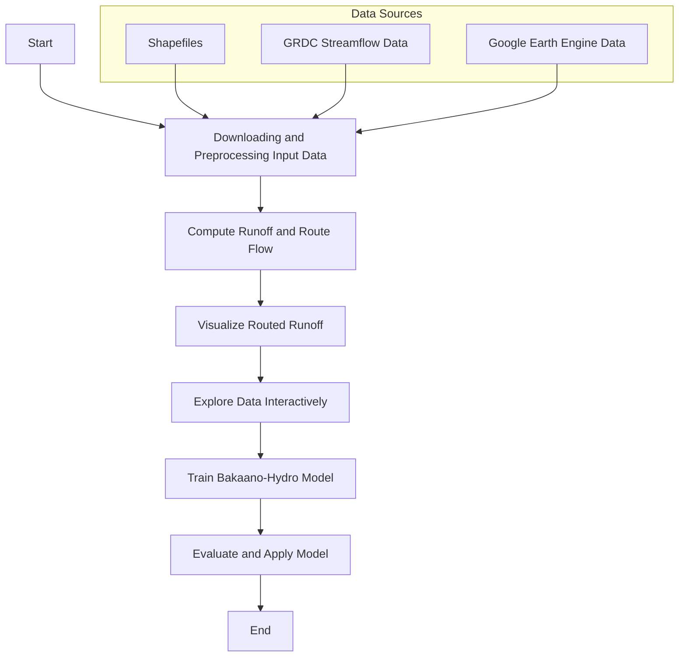

[](https://doi.org/10.5194/egusphere-2025-1633) [](https://github.com/confidence-duku/bakaano-hydro/blob/main/LICENSE) [](https://pypi.org/project/bakaano-hydro/)
 [](https://github.com/confidence-duku/bakaano-hydro/releases) [](https://github.com/confidence-duku/bakaano-hydro/commits/main) [](https://www.python.org/) 


# Bakaano-Hydro

## Description

Bakaano-Hydro is a distributed hydrology-guided neural network model for streamflow prediction. It uniquely integrates physically based hydrological principles with the generalization capacity of machine learning in a spatially explicit and physically meaningful way. This makes it particularly valuable in data-scarce regions, where traditional hydrological models often struggle due to sparse observations and calibration limitations, and where current state-of-the-art data-driven models are constrained by lumped modeling approaches that overlook spatial heterogeneity and the inability to capture hydrological connectivity. 

By learning spatially distributed, physically meaningful runoff and routing dynamics, Bakaano-Hydro is able to generalize across diverse catchments and hydro-climatic regimes. This hybrid design enables the model to simulate streamflow more accurately and reliably—even in ungauged or poorly monitored basins—while retaining interpretability grounded in hydrological processes.

The name Bakaano comes from Fante, a language spoken along the southern coast of Ghana. Loosely translated as "by the river side" or "stream-side", it reflects the  lived reality of many vulnerable riverine communities across the Global South - those most exposed to flood risk and often least equipped to adapt.


# Key Workflows
## Installation
Bakaano-Hydro is built on TensorFlow and is designed to leverage GPU acceleration for training. This requires a system with an NVIDIA GPU installed or bundled CUDA and cuDNN runtime libraries.
GPU acceleration is strongly recommended for training deep learning components and running large-scale simulations, as it significantly improves speed and scalability.

Note: Training on CPU is supported but will be significantly slower, especially on large datasets or deep learning tasks.
- For GPU acceleration:
  ```bash
  pip install bakaano-hydro[gpu]
  ```
  This will automatically install the correct version of TensorFlow along with CUDA and cuDNN runtime libraries

- For CPU-only usage:
  ```bash
  pip install bakaano-hydro
  ```

## Data Requirements

1. **Shapefile**: Defines the study area or river basin.
2. **Observed Streamflow Data**: NetCDF format from the Global Runoff Data Center.
3. **Google Earth Engine Registration**: Required for retrieving NDVI, tree cover, and meteorological data.

## Project-Specific Conventions

- **Data Sources**: The model relies on open-source data, including GRDC for streamflow and Google Earth Engine for tree cover, NDVI, Alpha Earth satellite embeddings, and meteorological variables.
- **End-to-End Automation**: The `runner.py` script automates the entire workflow, from data ingestion to streamflow prediction.
- **Modularity**: Each component is designed to be replaceable, allowing for easy adaptation to other datasets or modeling approaches.

## Running the Model

Refer to the `quick_start.ipynb` notebook for step-by-step guidance on executing the model pipeline. The steps include:

1. Preprocessing input data (e.g., shapefiles, GRDC data).
2. Training the model using the provided pipeline.
3. Evaluating the model's performance interactively.
4. Simulating streamflow and visualizing results.

## Workflow Diagram

Below is an updated workflow diagram illustrating the steps in the `quick_start.ipynb` notebook:



This updated diagram reflects the step "Downloading and Preprocessing Input Data" as described in the `quick_start.ipynb` notebook.

## Authors and acknowledgment

See CITATION.cff file.

Bakaano-Hydro was developed as part of Wageningen University & Research Investment theme 'Data-driven discoveries in a changing climate' and also as part of the KB program 'Climate resilient land use'.

## License

Apache License
