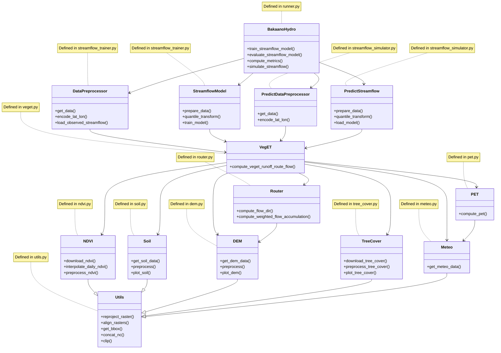

# Bakaano-Hydro

## Name
Bakaano-Hydro

## Description
Bakaano-Hydro  is a distributed hydrology-guided neural network modelling framework for simulating streamflows. It integrates the distributed hydrological representations of physical-based models with the capacity of deep learning techniques to learn and generalize across basins.Bakaano-Hydro provides a complete, integrated solution for simulating land surface hydrological processes, river flow routing, and streamflow, from raw data processing to model deployment.

Bakaano-Hydro leverages extensive data inputs—ranging from digital elevation models (DEMs) to meteorological time-series—and processes them through a robust sequence of automated steps. This includes the download, preprocessing, and alignment of source data, as well as regridding inputs to the desired spatial resolution, ensuring consistency and accuracy across all datasets.

It is highly adaptable, providing users with two primary options for data input: they can either let the model automatically download and preprocess all relevant input data or supply their own datasets. If users choose the latter, Bakaano-Hydro accommodates them by accepting data in the widely-used WGS84 geographic coordinate system (EPSG:4326), without the need for time-consuming clipping or regridding. The model seamlessly adjusts input data to match the DEM's spatial resolution, ensuring that all variables are consistently aligned for optimal performance.

## Installation

- Create and activate a conda environment 

```
conda create --name envname python=3.10.4
conda activate envname
```

- Install the Python libraries to that conda environment

```
sudo apt-get update
sudo apt-get install g++
pip install -r requirements.txt
```


## Usage

- See https://github.com/confidence-duku/bakaano-hydro/blob/main/Bakaano%20Hydro%20Tutorials.ipynb

## Code architecture



## Support
For assistance, please contact Confidence Duku (confidence.duku@wur.nl)

## Contributing
No contributions are currently accepted.

## Authors and acknowledgment
See CITATION.cff file.

## License
Apache License
