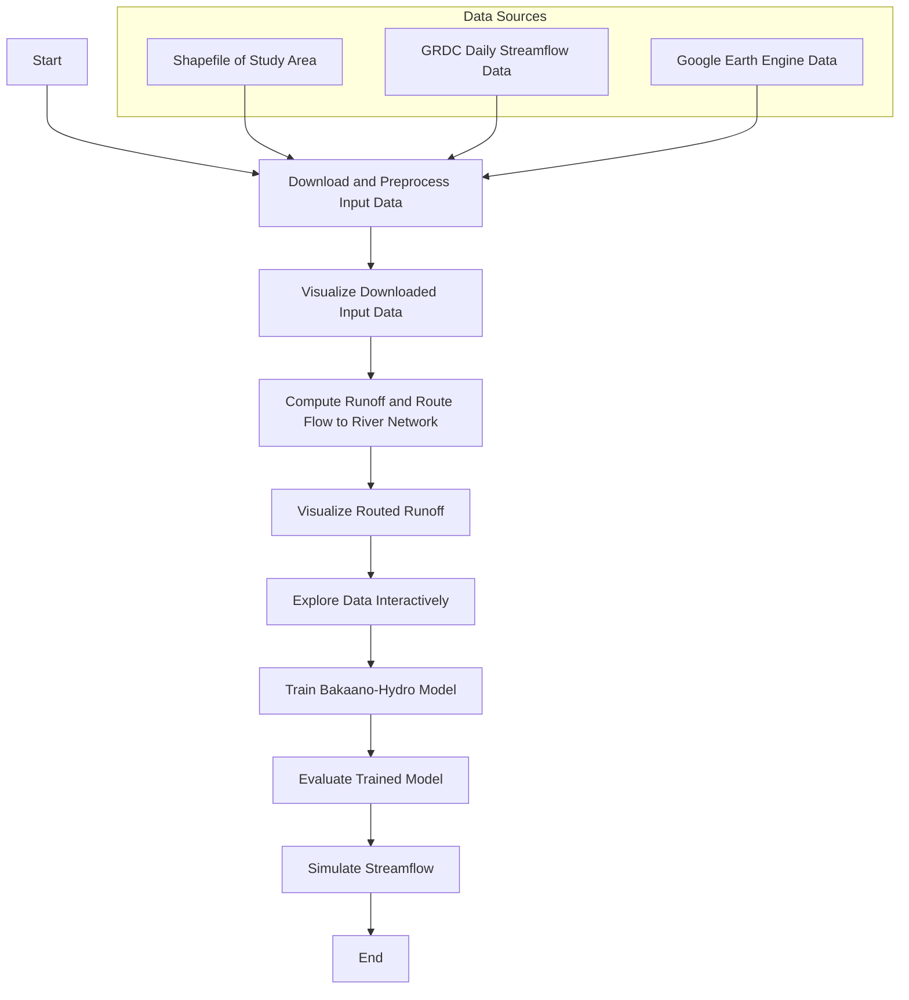
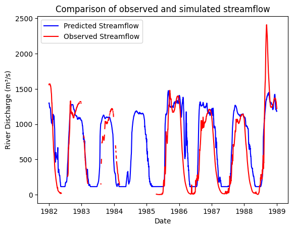

[](https://doi.org/10.5194/egusphere-2025-1633) [](https://github.com/confidence-duku/bakaano-hydro/blob/main/LICENSE) [](https://pypi.org/project/bakaano-hydro/)
 [](https://github.com/confidence-duku/bakaano-hydro/releases) [](https://github.com/confidence-duku/bakaano-hydro/commits/main) [](https://www.python.org/) 


# Bakaano-Hydro

## Description

Bakaano-Hydro is a distributed hydrology-guided neural network model for streamflow prediction. It uniquely integrates physically based hydrological principles with the generalization capacity of machine learning in a spatially explicit and physically meaningful way. This makes it particularly valuable in data-scarce regions, where traditional hydrological models often struggle due to sparse observations and calibration limitations, and where current state-of-the-art data-driven models are constrained by lumped modeling approaches that overlook spatial heterogeneity and the inability to capture hydrological connectivity. 

By learning spatially distributed, physically meaningful runoff and routing dynamics, Bakaano-Hydro is able to generalize across diverse catchments and hydro-climatic regimes. This hybrid design enables the model to simulate streamflow more accurately and reliably—even in ungauged or poorly monitored basins—while retaining interpretability grounded in hydrological processes.

The name Bakaano comes from Fante, a language spoken along the southern coast of Ghana. Loosely translated as "by the river side" or "stream-side", it reflects the  lived reality of many vulnerable riverine communities across the Global South - those most exposed to flood risk and often least equipped to adapt.


# Key Workflows
## Installation
Bakaano-Hydro is built on TensorFlow and is designed to leverage GPU acceleration for training. This requires a system with an NVIDIA GPU installed or bundled CUDA and cuDNN runtime libraries.
GPU acceleration is strongly recommended for training deep learning components and running large-scale simulations, as it significantly improves speed and scalability.

Note: Training on CPU is supported but will be significantly slower, especially on large datasets or deep learning tasks.
- For GPU acceleration:
  ```bash
  pip install bakaano-hydro[gpu]
  ```
  This will automatically install the correct version of TensorFlow along with CUDA and cuDNN runtime libraries

- For CPU-only usage:
  ```bash
  pip install bakaano-hydro
  ```

## Data Requirements

1. **Shapefile**: Defines the study area or river basin.
2. **Observed Streamflow Data**: NetCDF format from the Global Runoff Data Center.
3. **Google Earth Engine Registration**: Required for retrieving NDVI, tree cover, and meteorological data.

## Project-Specific Conventions

- **Data Sources**: The model relies on open-source data, including GRDC for streamflow and Google Earth Engine for tree cover, NDVI, Alpha Earth satellite embeddings, and meteorological variables.
- **End-to-End Automation**: The `runner.py` script automates the entire workflow, from data ingestion to streamflow prediction.
- **Modularity**: Each component is designed to be replaceable, allowing for easy adaptation to other datasets or modeling approaches.


## Workflow Diagram

Below is an updated workflow diagram illustrating the steps in the `quick_start.ipynb` notebook:



## Authors and acknowledgment

See CITATION.cff file.

Bakaano-Hydro was developed as part of Wageningen University & Research Investment theme 'Data-driven discoveries in a changing climate' and also as part of the KB program 'Climate resilient land use'.

## License

Apache License

## Quick demo
#####   1. Getting and preprocessing input data

If you have previously executed this step and downloaded all input data you can skip this step and proceed directly to step 2. However, if you are not sure, run step 1 and the model will either confirm that a specific data has aready been downloaded and subsequently viualize it or it will proceeed to download the data if it is not available or prior download was incomplete.


```python
working_dir='/lustre/backup/WUR/ESG/duku002/Drought-Flood-Cascade/niger'
study_area='/home/WUR/duku002/Scripts/NBAT/hydro/common_data/niger.shp'
```


```python

from bakaano.tree_cover import TreeCover
vf = TreeCover(
    working_dir=working_dir, 
    study_area=study_area, 
    start_date='2001-01-01', 
    end_date='2020-12-31'
)
vf.get_tree_cover_data()
vf.plot_tree_cover(variable='tree_cover') # options for plot are 'tree_cover' and 'herb_cover'
```

         - Tree cover data already exists in /lustre/backup/WUR/ESG/duku002/Drought-Flood-Cascade/niger/vcf/mean_tree_cover.tif; skipping download.
         - Tree cover data already exists in /lustre/backup/WUR/ESG/duku002/Drought-Flood-Cascade/niger/vcf/mean_tree_cover.tif; skipping preprocessing.


    

    


```python
# download and preprocess MODIS NDVI data from Google Earth Engine Data catalog

from bakaano.ndvi import NDVI
nd = NDVI(
    working_dir=working_dir, 
    study_area=study_area, 
    start_date='2001-01-01', 
    end_date='2010-12-31'
)
nd.get_ndvi_data()
nd.plot_ndvi(interval_num=10)  # because NDVI is in 16-day interval the 'interval_num' represents a 16-day period. 
                               #Hence 0 is the first 16 day period
```


         - NDVI data already exists in /lustre/backup/WUR/ESG/duku002/Drought-Flood-Cascade/niger/ndvi/daily_ndvi_climatology.pkl; skipping download.
         - NDVI data already exists in /lustre/backup/WUR/ESG/duku002/Drought-Flood-Cascade/niger/ndvi/daily_ndvi_climatology.pkl; skipping preprocessing.


    

    


```python
# Get elevation data

from bakaano.dem import DEM
dd = DEM(
    working_dir=working_dir, 
    study_area=study_area, 
    local_data=False, 
    local_data_path=None
)
dd.get_dem_data()
dd.plot_dem()
```


         - DEM data already exists in /lustre/backup/WUR/ESG/duku002/Drought-Flood-Cascade/niger/elevation; skipping download.


    

    


```python
# Get soil data

from bakaano.soil import Soil
sgd = Soil(
    working_dir=working_dir, 
    study_area=study_area
)
sgd.get_soil_data()
sgd.plot_soil(variable='wilting_point')  #options are 'wilting_point', 'saturation_point' and 'available_water_content'
```


         - Soil data already exists in /lustre/backup/WUR/ESG/duku002/Drought-Flood-Cascade/niger/soil; skipping download.


    

    


```python
#  Get alpha earth satellite embedding dataset

from bakaano.alpha_earth import AlphaEarth
dd = AlphaEarth(
    working_dir=working_dir, 
    study_area=study_area,
    start_date='2013-01-01', 
    end_date = '2024-01-01',
)
dd.get_alpha_earth()
dd.plot_alpha_earth('A35') #Band options are A00 to A63
```


    ✓ All 64 AlphaEarth bands already downloaded. Skipping.


    

    


```python
#get meteo

from bakaano.meteo import Meteo
cd = Meteo(
    working_dir=working_dir, 
    study_area=study_area, 
    start_date='2001-01-01', 
    end_date='2010-12-31',
    local_data=False, 
    data_source='ERA5'
)
cd.plot_meteo(variable='tasmin', date='2006-12-01') # variable options are 'tmean', 'precip', 'tasmax', 'tasmin'
```


         - ERA5 Land daily data already exists in /lustre/backup/WUR/ESG/duku002/Drought-Flood-Cascade/niger/era5_land; skipping download.


    

    


#####   2. Computing runoff and routing to river network


```python

from bakaano.veget import VegET
vg = VegET(
    working_dir=working_dir, 
    study_area=study_area,
    start_date='2001-01-01', 
    end_date='2010-12-31',
    climate_data_source='ERA5',
    routing_method='mfd'
)
vg.compute_veget_runoff_route_flow()
```


    Routed runoff data exists in /lustre/backup/WUR/ESG/duku002/Drought-Flood-Cascade/niger/runoff_output/wacc_sparse_arrays.pkl. Skipping processing


```python
#visualize routed runoff data

from bakaano.plot_runoff import RoutedRunoff
rr = RoutedRunoff(
    working_dir=working_dir, 
    study_area=study_area
)
rr.map_routed_runoff(date='2020-09-03', vmax=6) #output values have been log transformed for better visualization
```

    

    


#####   3. Explore input data, river networks and hydrological stations interactively


```python
from bakaano.runner import BakaanoHydro
bk = BakaanoHydro(
    working_dir=working_dir, 
    study_area=study_area,
    climate_data_source='ERA5'
)
bk.explore_data_interactively('1981-01-01', '2016-12-31', '/lustre/backup/WUR/ESG/duku002/NBAT/hydro/input_data/GRDC-Daily-africa-south-america.nc')
```


#####   4. Training, Evaluating and Applying Bakaano-Hydro model 


```python
# INITIALIZE INSTANCE OF BAKAANO-HYDRO MODEL

from bakaano.runner import BakaanoHydro
bk = BakaanoHydro(  
    working_dir=working_dir, 
    study_area=study_area,
    climate_data_source='ERA5'
)
```


```python
# TRAINING BAKAANO-HYDRO MODEL

# The model is trained using the GRDC streamflow data.

bk.train_streamflow_model(
    train_start='1991-01-01', 
    train_end='2020-12-31', 
    grdc_netcdf='/lustre/backup/WUR/ESG/duku002/NBAT/hydro/input_data/GRDC-Daily-africa-south-america.nc', 
    lookback=365, 
    batch_size=1024, 
    num_epochs=100
)
```


```python
# EVALUATING THE TRAINED MODEL INTERACTIVELY

# The model is evaluated using the GRDC streamflow data.
model_path = f'{working_dir}/models/bakaano_model.keras' 

bk.evaluate_streamflow_model_interactively(
    model_path=model_path, 
    val_start='1981-01-01', 
    val_end='1988-12-31', 
    grdc_netcdf='/lustre/backup/WUR/ESG/duku002/NBAT/hydro/input_data/GRDC-Daily-africa-south-america.nc', 
    lookback=365
)
```
    Available station names:
    ['AKKA' 'ALCONGUI' 'ANSONGO' ...]
    INFO:tensorflow:Using MirroredStrategy with devices ('/job:localhost/replica:0/task:0/device:CPU:0',)


    80/80 ━━━━━━━━━━━━━━━━━━━━ 6s 65ms/step
    Nash-Sutcliffe Efficiency (NSE): 0.7122612622507017
    Kling-Gupta Efficiency (KGE): 0.7443427177596089


    

    


```python
# PREDICTING STREAMFLOW USING THE TRAINED MODEL AND STORING AS CSV FILES 
# The model is used to predict streamflow in any location in the study area. 

model_path = f'{working_dir}/models/bakaano_model.keras'

bk.simulate_streamflow(
    model_path=model_path, 
    sim_start='1981-01-01', 
    sim_end='1988-12-31', 
    latlist=[13.8, 13.9, 9.15, 8.75, 10.66, 9.32, 7.8, 8.76, 6.17],
    lonlist=[3.0, 4.0, 4.77, 5.91, 4.69, 4.63, 8.91, 10.82, 6.77],
    lookback=365
)

```


